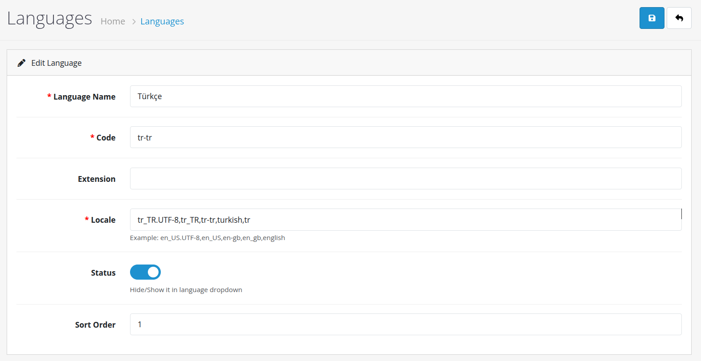

# OpenCart Turkish Language Pack

A Turkish language pack for [OpenCart](https://www.opencart.com/).

This project provides Turkish translations for the OpenCart storefront,
administration panel, checkout, payment and shipping methods, customer
accounts, reports, e-mail notifications, and other standard OpenCart
components.

The translation files preserve the original OpenCart language keys,
placeholders, HTML elements, and file structure.

## Version

**v1.0.0**

This is the first release of the OpenCart Turkish Language Pack.

## Compatibility

This language pack is prepared and tested for:

- **OpenCart 4.1.0.4**

Compatibility with other OpenCart versions has not been verified.

## Features

- Turkish administration panel translations
- Turkish storefront translations
- Customer account and registration pages
- Shopping cart and checkout translations
- Payment method translations
- Shipping method translations
- Order and return translations
- Customer and sales reports
- Dashboard modules
- Default OpenCart extensions
- E-mail notification translations
- Error and validation messages
- GDPR-related translations
- Blog and comment translations

## Installation

The repository follows the OpenCart installation directory structure.

Copy the contents of the `public_html` directory from this repository to
the root directory of your OpenCart installation.

The language files are provided in the following locations:

```text
public_html/
├── admin/
│   └── language/
│       └── tr-tr/
│
├── catalog/
│   └── language/
│       └── tr-tr/
│
└── extension/
    └── opencart/
        ├── admin/
        │   └── language/
        │       └── tr-tr/
        │
        └── catalog/
            └── language/
                └── tr-tr/
```

Copy these directories to the corresponding locations in your OpenCart
installation while preserving the directory structure.

For example:

```text
Repository:
public_html/admin/language/tr-tr/

OpenCart:
admin/language/tr-tr/
```

```text
Repository:
public_html/catalog/language/tr-tr/

OpenCart:
catalog/language/tr-tr/
```

The extension language files are installed as follows:

```text
Repository:
public_html/extension/opencart/admin/language/tr-tr/

OpenCart:
extension/opencart/admin/language/tr-tr/
```

```text
Repository:
public_html/extension/opencart/catalog/language/tr-tr/

OpenCart:
extension/opencart/catalog/language/tr-tr/
```

Preserve all directory names and file names exactly as provided.

Do not rename the `tr-tr` language directories or the language files.

## Adding Turkish to OpenCart

Copying the language files to the server is not enough.

Turkish must also be added and enabled as a language in the OpenCart
administration panel.

Go to:

```text
Administration Panel
→ System
→ Localisation
→ Languages
```

Add a new language and configure it for Turkish.

Recommended settings:

| Setting | Value |
|---|---|
| Name | Türkçe |
| Code | tr-tr |
| Locale | tr_TR.UTF-8 |
| Directory | tr-tr |
| Status | Enabled |
| Sort Order | As desired |

The exact available fields may vary depending on the OpenCart version.

### Language Configuration



## Usage

After installing and enabling the language pack, Turkish can be selected
from the language settings in OpenCart.

If Turkish is configured as the default language, the corresponding
OpenCart interfaces will use the Turkish translations provided by this
project.

## Translation Scope

This project focuses on translating user-visible text while preserving
the original OpenCart language file structure.

The following elements are preserved:

- Language keys
- PHP variable names
- Format placeholders such as `%s` and `%d`
- HTML links and tags
- Required escaping
- Original file structure

For example:

```php
$_['text_success'] = 'Başarılı: İşlem başarıyla tamamlandı!';
```

The language key remains unchanged while the displayed text is translated.

## Installation Notes

Before installing the language pack:

1. Back up your OpenCart installation.
2. Verify that the language pack matches OpenCart 4.1.0.3.
3. Copy the contents of the `public_html` directory to the OpenCart root
   directory.
4. Add and enable Turkish from the OpenCart administration panel.
5. Clear OpenCart modification or cache files if required by your installation.
6. Select Turkish and verify the storefront and administration panel.

## Screenshots

Screenshots related to installation and configuration are stored in:

```text
docs/
└── images/
    └── turkish-language-settings.png
```

### Turkish Language Configuration


Additional screenshots may be added in future releases.

## Updates

New OpenCart versions may introduce new language keys or modify existing
language files.

For this reason, compatibility should be checked before installing the
language pack on a different OpenCart version.

Future releases may include:

- New translations
- Missing translation fixes
- Translation corrections
- Compatibility updates
- Additional OpenCart component translations

## Reporting Translation Issues

If you find a missing, incorrect, or untranslated text, please report it
through the repository issue tracker.

When reporting a translation issue, please provide:

- OpenCart version
- Page or section where the problem occurs
- Language file path
- Original English text
- Current Turkish translation

A screenshot is also helpful when reporting an issue.

## Contributing

Contributions and translation improvements are welcome.

When submitting a translation correction, please preserve the original
OpenCart language key and file structure.

For example:

```php
$_['text_example'] = 'Türkçe çeviri';
```

Do not rename language keys unless the corresponding OpenCart source code
also requires such a change.

## License

See the `LICENSE` file for licensing information.

## Citation

If you use this project in an academic publication, technical report,
research project, or other work that requires attribution, please refer to
the project's `CITATION.cff` file.

## Release History

Release history is maintained through the repository's release system.

### v1.0.0

Initial release of the OpenCart Turkish Language Pack.

- Initial Turkish translation set
- Administration panel translations
- Storefront translations
- Checkout translations
- Payment and shipping translations
- Report translations
- E-mail translations
- Default extension translations